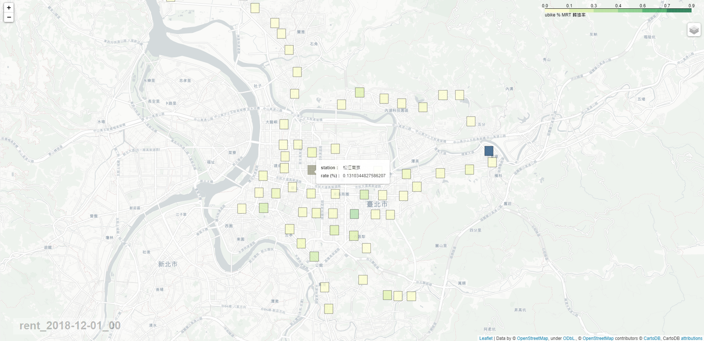
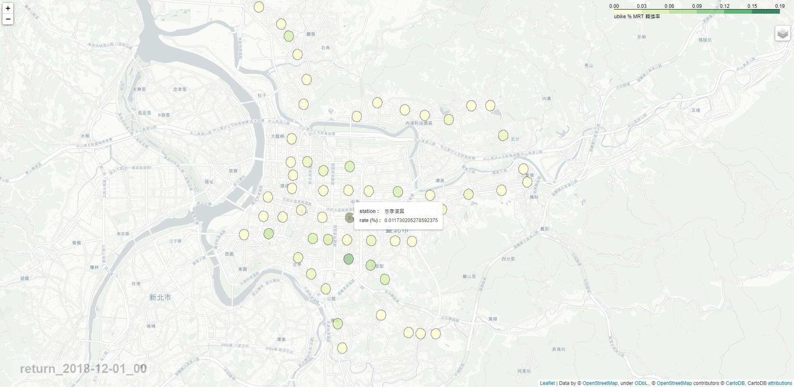

# 利用Geojson與folium製作臺北捷運與youbike分時轉換率熱區圖
<p align="center">
  <br>
  <b>🏴‍☠️ Information Gathering tool 🏴‍☠️ - DNS / Subdomains / Ports / Directories enumeration</b><br>
  <br>
  <!-- go-report-card -->
</p>

##  Abstract
   心血來潮花個一天的時間，利用公開資料將臺北捷運分時進出站統計數據與youbike公共自行車租用紀錄做轉換率的計算，首先透過捷運站個出口的座標找尋附近的youbike場站，之後透過創建.geojson搭配folium Choropleth產生分時熱區圖，將臺北捷運與youbike的轉換率視覺化

## Data Source
- [臺北捷運各站分時進出量統計](http://163.29.157.32:8080/fi/dataset/98d67c29-464a-4003-9f78-b1cbb89bff59)
- [臺北捷運車站出入口座標](https://data.taipei/#/dataset/detail?id=cfa4778c-62c1-497b-b704-756231de348b)
- [臺北市自行車租借紀錄](https://data.taipei/#/dataset/detail?id=9d9de741-c814-450d-b6bb-af8c438f08e5)

## Data Prepare
#### code -> mrt_data_prepare.py

```python
import pandas as pd

# Read Data
df = pd.read_csv('./data/臺北捷運每日分時各站OD流量統計資料_201812.csv',
                 delim_whitespace=True, error_bad_lines=False).iloc[1:-1]
# Create datetime column
df['time'] = df['日期'] + ' ' + df['時段'].astype('str').str.strip().str.zfill(2)
df['time'] = pd.to_datetime(df['time'], format='%Y-%m-%d %H')

# Calculate in & out static data and export
df['人次'] = df['人次'].astype('int')
df_in = df.groupby(['time', '進站']).sum().reset_index()
df_in.rename(columns={'進站': '站點'}).to_csv('./data/in.csv', index=False, encoding='utf-8-sig')

df_out = df.groupby(['time', '出站']).sum().reset_index()
df_out.rename(columns={'出站': '站點'}).to_csv('./data/out.csv', index=False, encoding='utf-8-sig')
```

## Find Mrt_station Near Youbike_station
#### code -> find_youbike_station.py

```python
import pandas as pd
import numpy as np

ubike_wgs = pd.read_csv('./data/ubike_wgs.csv')[['sno', 'sna', 'lat', 'lng']]
ubike_wgs = ubike_wgs.sort_values(by=['lng', 'lat']).reset_index(drop=True)

mrt_out_wgs = pd.read_csv('./data/臺北捷運車站出入口座標.csv', encoding='utf-8')
mrt_out_wgs['站點'] = mrt_out_wgs['出入口名稱'].str.split('站', expand=True)[0]


def find(station):
    temp = mrt_out_wgs[mrt_out_wgs['站點'] == station].reset_index(drop=True)  # select station
    center_lat, center_lon = np.mean(temp['緯度']), np.mean(temp['經度'])  # Calculate exits center point
    radius = 0.002  # 200m
    neighbor = []
    for x in range(len(ubike_wgs)):
        if (ubike_wgs.at[x, 'lat'] - center_lat) ** 2 + (ubike_wgs.at[x, 'lng'] - center_lon) ** 2 < radius ** 2:
            neighbor.append(ubike_wgs.at[x, 'sna'])  
        # if (x-center_x)^2 + (y - center_y)^2 < radius^2 -> this ubike station in this mrt_station
    return radius, center_lat, center_lon, list(set(neighbor))
 ```
 
## Create Youbike_station Static Data
#### code -> get_youbike_data.py

```python
import pandas as pd

data = pd.read_csv('./data/201812.csv')
df_rent = pd.DataFrame(data.groupby(['rent_time', 'rent_station']).size(), columns=['rent_size']).reset_index()
df_return = pd.DataFrame(data.groupby(['return_time', 'return_station']).size(), columns=['return_size']).reset_index()


def get_size(temp, station):
    # get each station static data
    if temp == 'rent':
        return df_rent[df_rent['rent_station'] == station].reset_index(drop=True)
    else:
        return df_return[df_return['return_station'] == station].reset_index(drop=True)


def cal_data(temp, station_list):
    # Calculate near station static data
    df = pd.DataFrame()
    for station in station_list:
        df = df.append(get_size(temp, station))
    if temp == 'rent':
        return df.groupby(['rent_time']).sum().reset_index().rename(columns={'rent_time': 'time', 'rent_size': 'size'})
    else:
        return df.groupby(['return_time']).sum().reset_index().rename(columns={'return_time': 'time', 'return_size': 'size'})
 
def get_all_mrt_station(ty, time):  #get mrt all station near youbike static Data
    # ty -> in or out (mrt) time -> datetime
    # read mrt data
    # if mrt type = in -> youbike = return
    # if mrt type = out -> youbike = rent

    if ty == 'in':
        df = pd.read_csv('./data/in.csv')
        type_ubike = 'return'
    else:
        df = pd.read_csv('./data/out.csv')  # read mrt data
        type_ubike = 'rent'
    station_list = list(df['站點'].unique())  # get all station
    station_dict = {}
    data = pd.DataFrame()
    for index, station in enumerate(station_list):
        print(station)
        radius, center_lat, center_lon, neighbor = find_youbike_station.find(station)  # get station near range info
        select = df[df['站點'] == station].reset_index()  # select mrt data
        t = select[select['time'] == time].index.tolist()[0]  # get time index
        if len(neighbor) > 0:  # if station near have youbike station
            station_dict[station] = [radius, center_lat, center_lon]  # save station range
            df_ubike = cal_data(type_ubike, neighbor)  # get youbike data
            select = select.merge(df_ubike, on=['time'], how='left').fillna(0)  # merge youbike data & mrt data
            data.at[index, 'station'] = station
            data.at[index, 'rate'] = select.at[t, 'size'] / select.at[t, '人次']  # change rate
    return data.reset_index(drop=True), station_dict, type_ubike
 ```
* #### data

|  | time | station | rate |
| :---: | :---: | :---: | :---: |
| 0 | 2018-12-01 00:00:00 | 中山 | 0.004975 |
| 1 | 2018-12-01 00:00:00 | 中山國中 | 0.076923 |
| 2 | 2018-12-01 00:00:00 | 中山國小 | 0.050926 |
| ... | ... | ... | ... |

* #### station_dict
```
{'中山': [0.002, 25.052689166666667, 121.52019366666667], '中山國中': [0.002, 25.060889, 121.544031],...}    
```

## Get Square or Circle Geojson
#### code -> plot_map.py --> get_square_json() or get_circle_json()

```python
import json
from shapely.geometry import Polygon, Point
import shapely


def get_square_json(station_dict):
    features = []
    geo_data = dict()
    for index, station_data in enumerate(list(station_dict.items())):
        station, radius, center_lat, center_lon = station_data[0], station_data[1][0], station_data[1][1], station_data[1][2]
        top = float(center_lon) + radius
        down = float(center_lon) - radius
        right = float(center_lat) + radius
        left = float(center_lat) - radius
        area = [[[top, left], [top, right], [down, right], [down, left], [top, left]]]
        type_dict = {"type": "Feature", "id": station, "properties": {"name": station}, "geometry": {"type": "Polygon", "coordinates": area}}
        features.append(type_dict)
        geo_data[station] = Polygon([(top, left), (top, right), (down, right), (down, left), (top, left)])
    all_dict = {"type": "FeatureCollection", "features": features}
    state_geo = json.dumps(all_dict)
    return geo_data, state_geo

def get_circle_json(station_dict):
    features = []
    geo_data = dict()
    for index, station_data in enumerate(list(station_dict.items())):
        station, radius, center_lat, center_lon = station_data[0], station_data[1][0], station_data[1][1], station_data[1][2]
        center = Point([center_lon, center_lat])
        circle = center.buffer(radius)  # Degrees Radius
        type_dict = {"type": "Feature", "id": station, "properties": {"name": station}, "geometry": shapely.geometry.mapping(circle)}
        features.append(type_dict)
        geo_data[station] = Polygon(shapely.geometry.mapping(circle)['coordinates'][0])

    all_dict = {"type": "FeatureCollection", "features": features}
    state_geo = json.dumps(all_dict)
    return geo_data, state_geo
 ```
 * #### geo_data
##### mrt_station shape -> dict
```
{'中山': <shapely.geometry.polygon.Polygon object at 0x0000023C2E20DAC0>, '中山國中': <shapely.geometry.polygon.Polygon object at 0x0000023C2E5B30D0>,...}  
```

* #### state_geo
##### mrt_station shape -> geojson
```
{"type": "FeatureCollection", "features": [{"type": "Feature", "id": "中山", "properties": {"name": "中山"}, "geometry": {"type": "Polygon", "coordinates": [[[121.52219366666667, 25.05068916666667]...]]]}}]}    
```

## Preview state_geo on [geojson.io](https://geojson.io/#map=12/25.0651/121.5423)
  #### square
 
  #### circle
 
 
## Let Square or Circle Geojson to Heatmap
#### code -> plot_map.py --> plot_choropleth()
```python
import folium
import branca.colormap as cm


def plot_choropleth(gdf, state_geo, time, type_ubike, plot_type):
    fmap = folium.Map(location=[25.0516, 121.552], zoom_start=13)  # map center
    folium.TileLayer('CartoDB positron', name="Light Map", control=False).add_to(fmap)  # base map
    folium.Choropleth(
        geo_data=state_geo,  # square or circle geojson
        data=gdf,
        name='choropleth',
        columns=['station', 'rate'],
        key_on='feature.id',
        fill_color='YlGn',
        fill_opacity=0.5,
        line_opacity=0,
        highlight=True,
        legend_name='ubike % MRT 轉換率',
        reset=True
    ).add_to(fmap)
    folium.LayerControl().add_to(fmap)

    colormap = cm.linear.YlGnBu_09
    style_function = lambda x: {"weight": 0.5,
                                'color': 'black',
                                'fillColor': colormap(x['properties']['rate']),
                                'fillOpacity': 0.5}
    highlight_function = lambda x: {'fillColor': '#000000',
                                    'color': '#000000',
                                    'fillOpacity': 0.30,
                                    'weight': 0.1}
    info = folium.features.GeoJson(
        gdf,
        style_function=style_function,
        control=False,
        highlight_function=highlight_function,
        tooltip=folium.features.GeoJsonTooltip(fields=['station', 'rate'],
                                               aliases=['station :', 'rate (%) :'],
                                               style=("background-color: white; color: #333333; font-family: arial; font-size: 12px; padding: 10px;"),
                                               sticky=True
                                               )
    )
    fmap.add_child(info)
    fmap.keep_in_front(info)

    # add a div on map
    legend_html = """ 
                 <div style="
                 position: fixed; 
                 bottom: 20px; left: 35px; width: 330px; height: 45px; 
                 z-index:9999; 

                 background-color:white;
                 
                 opacity: .3;

                 font-size:30px;
                 font-weight: bold;

                 ">
                 &nbsp; {title} 
                  </div> """.format(title=f'{type_ubike}_{time}', itm_txt="""<br><i style="color:{col}"></i>""")

    fmap.get_root().html.add_child(folium.Element(legend_html))
    fmap.save(f'./map/{type_ubike}_{time}_{plot_type}.html')  # save map
 ```
 ## Demo map 
  #### square
 
  #### circle
 
  #### detail
 

## Run
#### code -> main.py

```python
import pandas as pd
import datetime
import geopandas as gpd
from get_youbike_data import get_all_mrt_station
import plot_map

y, m, d, h = 2018, 12, 1, 0  # year, month, day, hour
time = str(datetime.datetime(y, m, d, h, 0, 0))

''' choose mrt {type mrt = in <-> ubike = return} {mrt = out <-> ubike = rent}'''

ty = 'in'
# ty = 'out'

''' choose plot type'''
# plot_type = 'circle'
plot_type = 'square'

data, station_dict, type_ubike = get_all_mrt_station(ty, time)

if plot_type == 'circle':
    geo_data, state_geo = plot_map.get_circle_json(station_dict)
else:
    geo_data, state_geo = plot_map.get_square_json(station_dict)

geo_data = pd.DataFrame.from_dict(geo_data, orient='index',
                                  columns=['geometry']).reset_index().rename(columns={'index': 'station'})
gdf = gpd.GeoDataFrame(data, geometry=geo_data['geometry'])

gdf.set_crs(epsg=4326, inplace=True)
time = time.replace(' ', "_")[:13]
gdf.to_file(f'./geojson/{type_ubike}_{time}.geojson', driver='GeoJSON')
plot_map.plot_choropleth(gdf, state_geo, time, type_ubike, plot_type)
```

* #### gdf

|  | time | station | rate | geometry |
| :---: | :---: | :---: | :---: | :--- |
| 0 | 2018-12-01 00:00:00 | 中山 | 0.004975 | POLYGON ((121.5221936666667 25.05068916666667,... )) |
| 1 | 2018-12-01 00:00:00 | 中山國中 | 0.076923 | POLYGON ((121.546031 25.058889, 121.546031 25.... )) |
| 2 | 2018-12-01 00:00:00 | 中山國小 | 0.050926 | POLYGON ((121.528548 25.060653, 121.528548 25....|
| ... | ... | ... | ... | ... |
 
## Conclusion
  最終能得到各小時臺北捷運分時進出站統計數據與youbike公共自行車租用紀錄轉換率熱區圖，得到.html的map，若想要.png or .jpg ，可以使用selenium.webdriver透過瀏覽器Screenshot來獲得，
  最後完成～收工!
  Thanks :)


